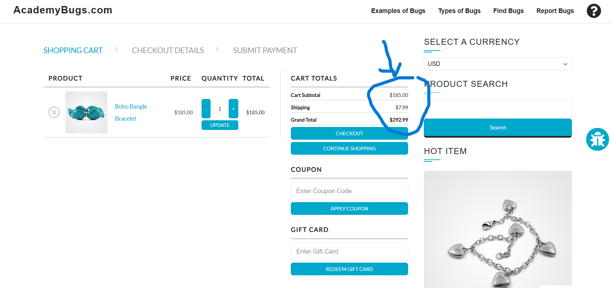

# BUG-001 – Shopping Cart Grand Total Is Calculated Incorrectly

**Title:**  
[Shopping Cart] Grand Total is incorrectly calculated after adding Boho Bangle Bracelet

**Environment:**
- Application: AcademyBugs
- Browser: Google Chrome
- Device: Desktop
- Environment: Web / Practice Test Site

**Severity:** High

**Priority:** High

**Reproducibility:** 3/3

## Preconditions
- User is on the AcademyBugs shop page.
- Shopping cart is empty.

## Steps to Reproduce
1. Open the AcademyBugs shop.
2. Locate the **Boho Bangle Bracelet** product.
3. Add the product to the shopping cart.
4. Open the Shopping Cart page.
5. Observe the Cart Subtotal, Shipping, and Grand Total values.

## Expected Result
The Grand Total should equal:

- Cart Subtotal: `$185.00`
- Shipping: `$7.99`
- Expected Grand Total: `$192.99`

## Actual Result
The application displays:

- Cart Subtotal: `$185.00`
- Shipping: `$7.99`
- Actual Grand Total: `$292.99`

The displayed Grand Total is `$100.00` higher than the correct calculated amount.

## Evidence

### Observed behavior

## Additional Information
The issue is consistently reproducible using the same product and cart flow.
