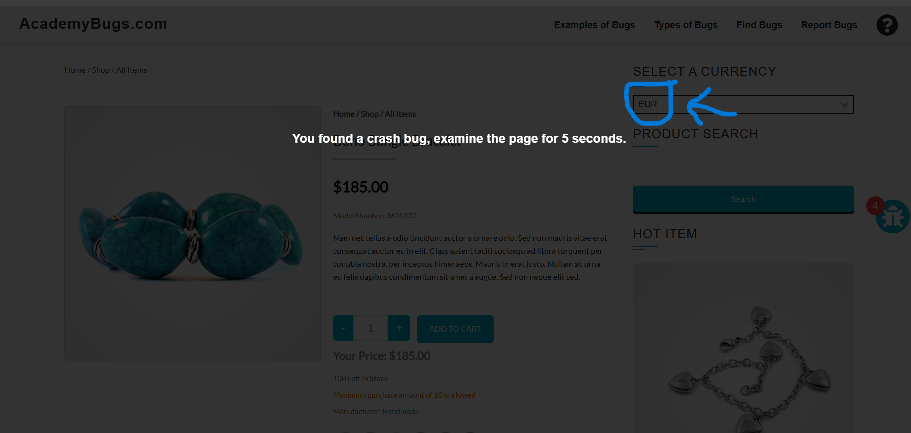
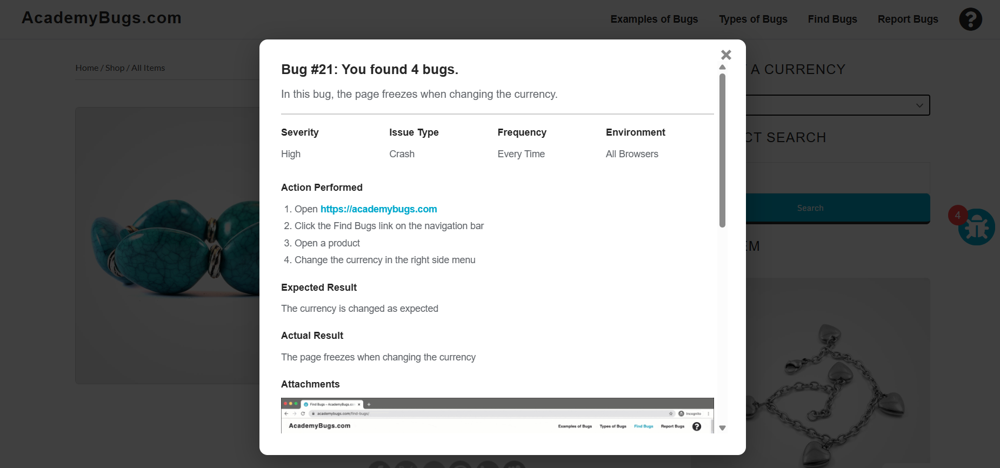

# BUG-002 – Page Becomes Unresponsive When Changing Currency

**Title:**  
[Shopping Cart] Page becomes unresponsive when changing currency

**Environment:**
- Application: AcademyBugs
- Device: Desktop
- Browsers: Google Chrome, Brave
- Environment: Web / Practice Test Site

**Severity:** High

**Priority:** High

**Reproducibility:** 3/3

## Preconditions
- User is on the Shopping Cart page.
- At least one product is present in the shopping cart.

## Steps to Reproduce
1. Open the AcademyBugs shop.
2. Add a product to the shopping cart.
3. Open the Shopping Cart page.
4. Locate the **Select a Currency** dropdown.
5. Select a currency different from the currently selected currency.
6. Observe the page behavior.

## Expected Result
- The selected currency should be applied successfully.
- Product prices, shipping cost, and cart totals should be displayed in the selected currency.
- The Shopping Cart page should remain responsive.

## Actual Result
- The Shopping Cart page becomes unresponsive after changing the currency.
- The user is unable to continue interacting with the page normally.

## Evidence

### Observed behavior

### Bug details

## Additional Information
- The issue was reproduced 3/3 times.
- The issue was reproduced in multiple browsers.
