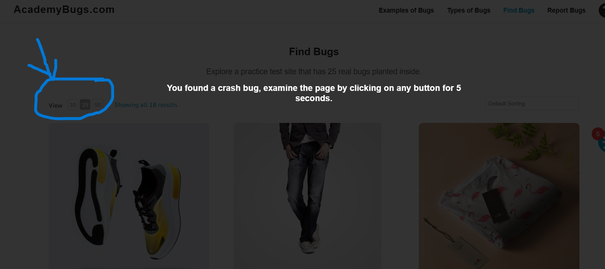
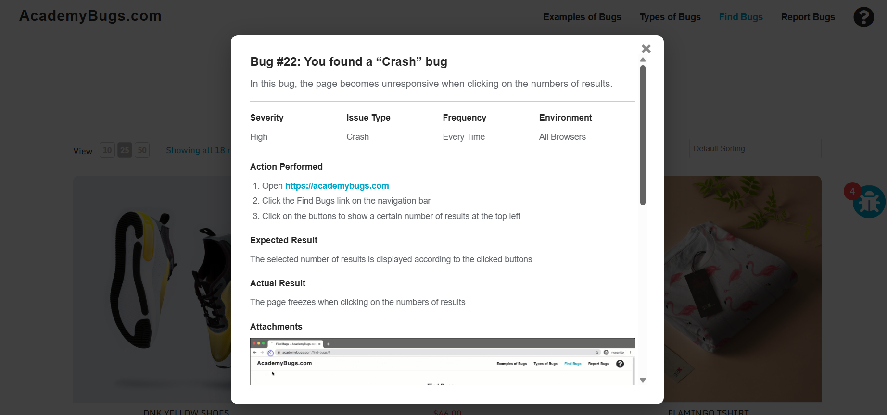

# BUG-003 – Page Becomes Unresponsive When Changing Number of Displayed Results

**Title:**  
[Product Listing] Page becomes unresponsive when changing the number of displayed results

**Bug Type:** Functional

**Environment:**
- Application: AcademyBugs
- Device: Desktop
- Browsers: Google Chrome and Brave
- Environment: Web / Practice Test Site

**Severity:** Medium

**Priority:** Medium

**Reproducibility:** 5/5 in Google Chrome; also reproduced in Brave

## Preconditions
- User is on the AcademyBugs product listing page.

## Steps to Reproduce
1. Open the AcademyBugs product listing page.
2. Locate the **View 10 / 25 / 50** results selector.
3. Click one of the available result-count options.
4. Observe the page behavior.

## Expected Result
- The selected number of products should be displayed.
- The product listing page should remain responsive.

## Actual Result
- The page becomes unresponsive after selecting a different number of results.
- The requested number of products is not displayed as expected.

## Evidence

### Observed behavior

### Bug details

## Additional Information
- The issue was reproduced consistently in multiple browsers.
- The behavior is not isolated to Google Chrome.
