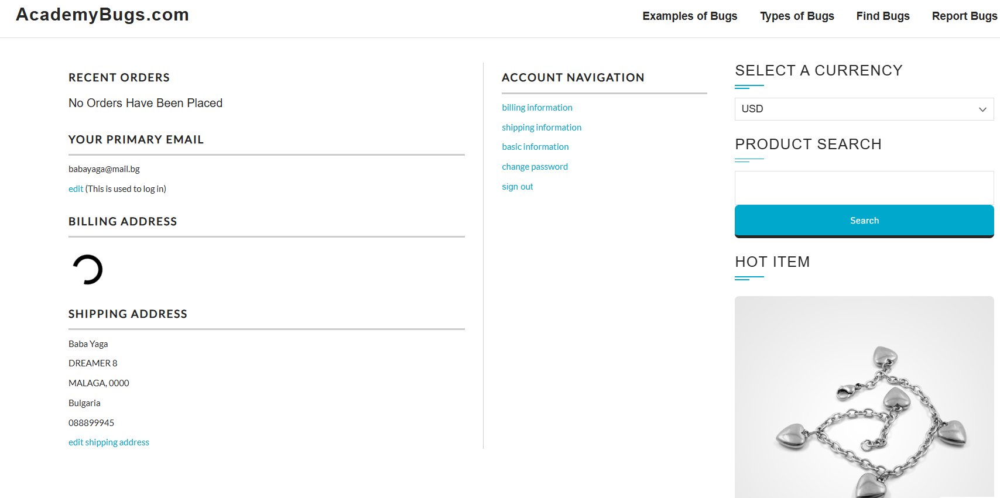
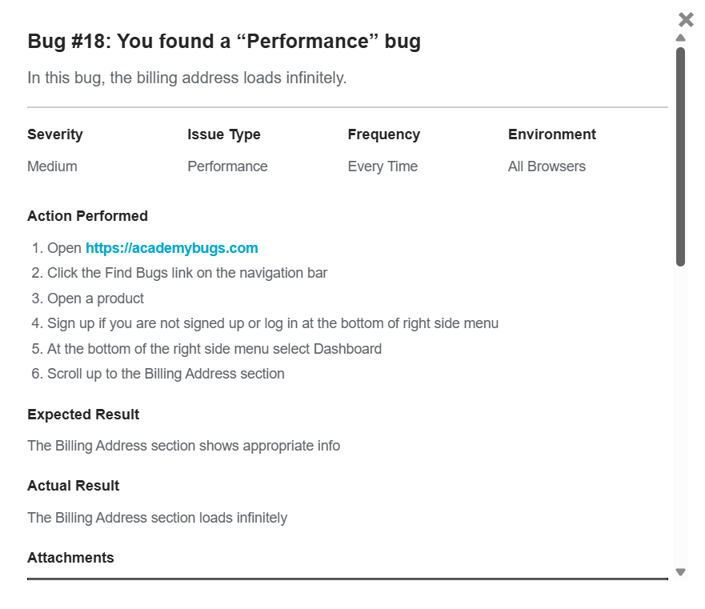

# BUG-004 – Billing Address Section Remains in an Infinite Loading State

**Title:**  
[Billing Address] Billing Address section remains in an infinite loading state

**Bug Type:** Functional

**Environment:**
- Application: AcademyBugs
- Device: Desktop
- Browsers: Google Chrome, Brave
- Environment: Web / Practice Test Site

**Severity:** Medium

**Priority:** High

**Reproducibility:** 3/3

## Preconditions
- User has a registered AcademyBugs account.
- User is logged in.

## Steps to Reproduce
1. Open the AcademyBugs website.
2. Navigate to the **Find Bugs** page.
3. Open a product.
4. Locate the account section in the right-side menu.
5. Select **Dashboard**.
6. Navigate to the **Billing Address** section.
7. Observe the Billing Address section.

## Expected Result
The Billing Address section should finish loading and display the user's billing address information.

## Actual Result
The Billing Address section remains in an infinite loading state and the billing address information is not displayed.

## Evidence

### Observed behavior

### Bug details

## Additional Information
- The issue was reproduced 3/3 times.
- The issue was reproduced in both Google Chrome and Brave.
